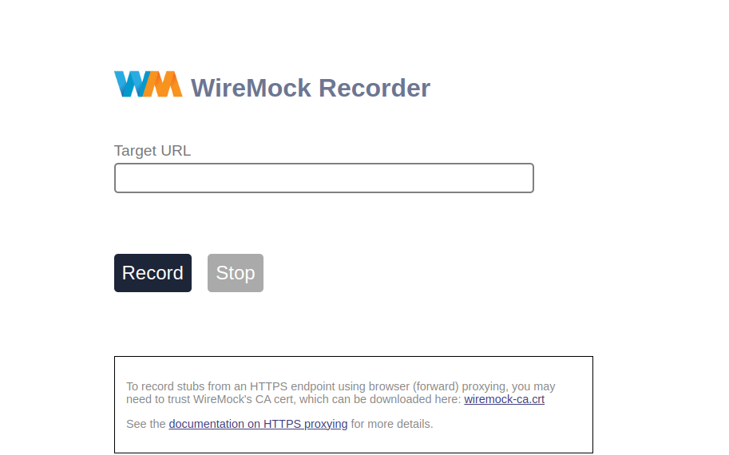
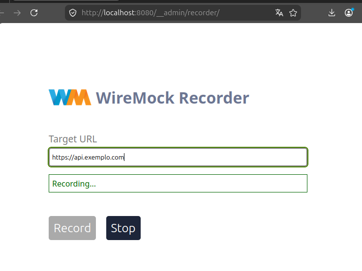
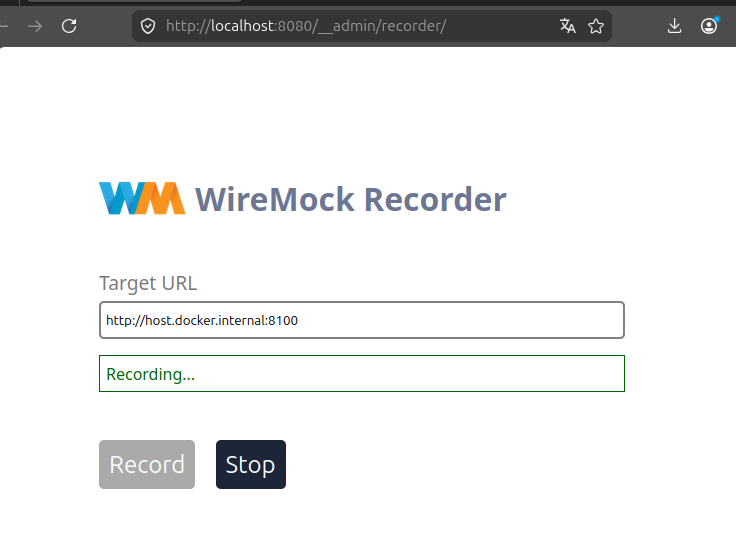
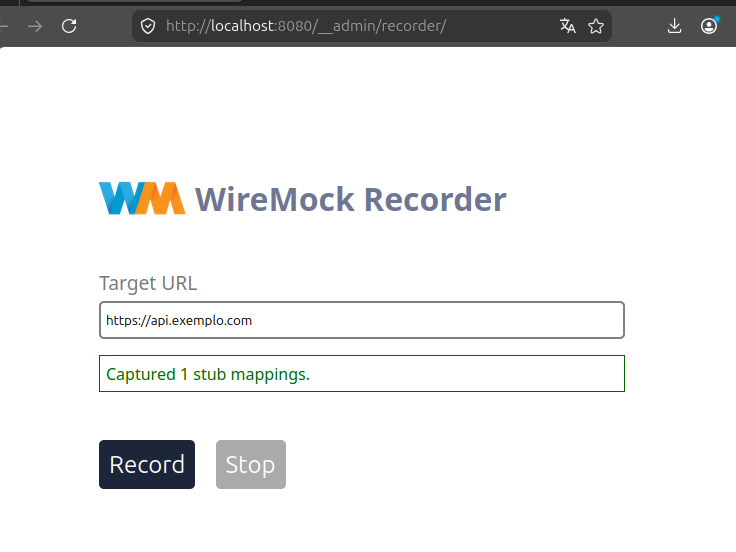
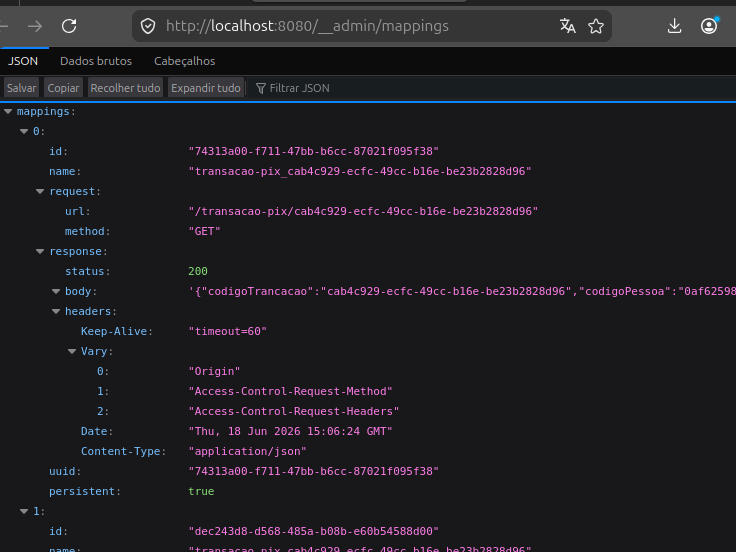

# WireMock Recorder - Guia de Utilização

## Objetivo

Este documento demonstra como utilizar o recurso **Recorder** do WireMock para capturar requisições realizadas a uma API real e gerar automaticamente mappings e responses que poderão ser utilizados em testes e ambientes de desenvolvimento.

## O que é o WireMock Recorder?

O WireMock Recorder permite:

* Capturar chamadas HTTP enviadas para um serviço real.
* Gerar arquivos de mock automaticamente.
* Simular APIs externas sem depender da disponibilidade do serviço original.
* Facilitar testes de integração e desenvolvimento local.

---

## Pré-requisitos

* Docker
* Docker Compose
* Acesso à API que será gravada

---

## Executando o WireMock com Docker

Uma forma prática de utilizar o WireMock é através de containers Docker. Isso facilita a configuração do ambiente e garante consistência entre diferentes máquinas e equipes.

### Docker Compose

Crie um arquivo `docker-compose.yml` com o seguinte conteúdo:

```yaml
version: "3"

services:
  wiremock:
    image: wiremock/wiremock:latest
    container_name: my_wiremock

    extra_hosts:
      - "host.docker.internal:host-gateway"

    ports:
      - "8080:8080"

    expose:
      - "8080"

    volumes:
      - ./extensions:/var/wiremock/extensions
      - ./__files:/home/wiremock/__files
      - ./mappings:/home/wiremock/mappings

    entrypoint:
      [
        "/docker-entrypoint.sh",
        "--global-response-templating",
        "--disable-gzip",
        "--verbose"
      ]
```

---

## Estrutura de Diretórios

Antes de iniciar o container, crie a seguinte estrutura:

```text
project/
├── docker-compose.yml
├── mappings/
├── __files/
└── extensions/
```

### Diretórios

| Diretório    | Finalidade                                                           |
| ------------ | -------------------------------------------------------------------- |
| `mappings`   | Armazena os arquivos de configuração dos mocks gerados pelo WireMock |
| `__files`    | Armazena os corpos das respostas utilizadas pelos mocks              |
| `extensions` | Utilizado para extensões e customizações do WireMock                 |

---

## Subindo o Ambiente

Execute:

```bash
docker compose up -d
```

Verifique se o container está em execução:

```bash
docker ps
```

Acesse o WireMock:

```text
http://localhost:8080
```
### Acesso via Browser
Após subir o docker compose o acesso aos recursos, seguem alguns links como:

* WireMock Admin: http://localhost:8080/__admin
* WireMock Recorder: http://localhost:8080/__admin/recorder/
* WireMock Mappings: http://localhost:8080/__admin/mappings
* WireMock Certs:  http://localhost:8080/__admin/certs/wiremock-ca.crt

Um exemplo disso seria a tela WireMock Recorder: http://localhost:8080/__admin/recorder/ onde podemos
de forma visual configurar uma `Target URL(targetbaseurl)` que será explicado mais adiante:


---

## Iniciando uma Gravação

Para iniciar o modo Recorder, envie uma requisição para o endpoint de gravação:

```bash
curl -X POST http://localhost:8080/__admin/recordings/start \
-H "Content-Type: application/json" \
-d '{
  "targetBaseUrl": "https://api.exemplo.com"
}'
```

### Parâmetros

| Campo           | Descrição                        |
| --------------- | -------------------------------- |
| `targetBaseUrl` | URL da API real que será gravada |

Ou podemos também via browser configurar o destino no `Target URL` e clicar em `Record`: 



---

## Gravando uma API Local

Caso a API esteja rodando localmente na sua máquina, utilize o endereço `host.docker.internal` e a `porta`
que a aplicação está expondo.

Exemplo:

```bash
curl -X POST http://localhost:8080/__admin/recordings/start \
-H "Content-Type: application/json" \
-d '{
  "targetBaseUrl": "http://host.docker.internal:8100"
}'
```

Esse recurso é possível graças à configuração:

```yaml
extra_hosts:
  - "host.docker.internal:host-gateway"
```

Ela permite que o container WireMock acesse serviços executando diretamente na máquina host.

Agora se a gravação será configurado pelo browser o endereço seria feito adicionando no Target URL
conforme abaixo:


---

## Executando Chamadas para a API

Após iniciar a gravação, direcione suas chamadas para o WireMock.

Exemplo:

```bash
curl http://localhost:8080/api/clientes
```

Fluxo:

```text
Cliente
    │
    ▼
WireMock Recorder
    │
    ▼
API Real
```

O WireMock interceptará a requisição, encaminhará para a API real e armazenará a interação.

---

## Finalizando a Gravação

Quando todas as chamadas forem realizadas:

```bash
curl -X POST http://localhost:8080/__admin/recordings/stop
```
Se for via browser, clique em `Stop`. Veja se existe a frase `Capture 1 stub mappings`.
Caso tenha essa mensagem significa que ouve um captura de requisição.



Pode visualiar os mapping em WireMock Mappings: http://localhost:8080/__admin/mappings



---

## Estrutura dos Arquivos Gerados

Após a gravação, os arquivos serão criados automaticamente nas pastas montadas:

```text
mappings/
└── mapping-1.json

__files/
└── response-1.json
```

### Exemplo de Mapping

```json
{
  "request": {
    "method": "GET",
    "url": "/api/clientes"
  },
  "response": {
    "status": 200,
    "bodyFileName": "response-1.json"
  }
}
```

---

## Executando os Mocks Gravados

Caso reinicie o container, o WireMock carregará automaticamente os arquivos presentes nas pastas:

```text
mappings/
__files/
```

Suba novamente o ambiente:

```bash
docker compose up -d
```

Agora as respostas serão servidas localmente sem necessidade da API original.

---

## Explicação das Configurações Utilizadas

### `--global-response-templating`

Habilita o uso de templates em todas as respostas.

Exemplo:

```json
{
  "message": "Olá {{request.query.nome}}"
}
```

---

### `--disable-gzip`

Desabilita a compressão GZIP das respostas, facilitando inspeção e depuração.

---

### `--verbose`

Exibe logs detalhados do WireMock.

Para visualizar os logs:

```bash
docker logs -f my_wiremock
```

---

### `host.docker.internal`

Permite que o container acesse aplicações executando na máquina host.

Exemplo:

```json
{
  "targetBaseUrl": "http://host.docker.internal:3000"
}
```

Muito útil quando a API que será gravada está rodando localmente.

---

## Boas Práticas

### Evite gravar informações sensíveis

Não versione:

* Tokens JWT
* Senhas
* Chaves de API
* Dados pessoais

---

### Revise os mappings gerados

Os mappings criados automaticamente podem conter:

* IDs específicos
* Headers temporários
* Query parameters desnecessários

Recomenda-se revisar os arquivos antes de adicioná-los ao repositório.

---

### Grave cenários previsíveis

Utilize dados controlados para gerar mocks consistentes e reutilizáveis.

---

## Troubleshooting

### Nenhum mapping foi gerado

Verifique:

* Se a gravação foi iniciada corretamente.
* Se as requisições passaram pelo WireMock.
* Se a API de destino está acessível.

---

### Erro de conexão com API local

Verifique:

* Se a aplicação está rodando.
* Se a porta está correta.
* Se está utilizando `host.docker.internal`.

---

### Resposta diferente da esperada

Revise:

* Headers gravados.
* Query parameters.
* Matchers gerados automaticamente.

---

## Benefícios do Recorder

* Criação rápida de mocks.
* Redução da dependência de sistemas externos.
* Maior estabilidade dos testes.
* Facilidade para reproduzir cenários complexos.
* Agilidade no desenvolvimento local.

---

## Referências

* [WireMock Docs](https://wiremock.org/docs/)
* [Quick Start: API Mocking with Java and JUnit 4](https://wiremock.org/docs/quickstart/java-junit/)
* [Record and Playback](https://wiremock.org/docs/record-playback/)
* [Running in Docker](https://wiremock.org/docs/standalone/docker/)
* [Junit5 + Jupiter](https://wiremock.org/docs/junit-jupiter/)